<!-- README.md is generated from README.Rmd. Please edit that file -->

# hockeystick 

<!-- badges: start -->

[](https://lifecycle.r-lib.org/articles/stages.html)

[](https://CRAN.R-project.org/package=hockeystick)
[](https://cran.r-project.org/package=hockeystick)
<!-- badges: end -->

The goal of `hockeystick` is to make essential Climate Change datasets
easily available to non-climate experts. `hockeystick` users can
download the latest raw data from authoritative sources as well as view
it via pre-defined ggplot2 charts. Datasets include atmospheric
CO<sub>2</sub>, instrumental, reconstructed, and paleo ice-core
temperature records, sea levels, and Arctic/Antarctic sea-ice.

The choice of data was originally based on [Professor Stefan
Rahmstorf’s](http://www.pik-potsdam.de/~stefan/) presentation on [The 5
Most Important Data Sets of Climate
Science](http://www.pik-potsdam.de/~stefan/5datasets_rahmstorf.pdf). I
came across this on a post on the [Open Mind
blog](https://tamino.wordpress.com/2018/11/01/the-5-most-important-data-sets-of-climate-science/).
I wrote my own
[post](https://rethinking.rbind.io/2018/11/16/the-top-five-climate-charts-using-ggplot2/)
on obtaining and visualizing this data (now out of date), which is the
basis for this package. Additional datasets and visualizations have been
added over The name of the package stems from the well known
[hockeystick](https://en.wikipedia.org/wiki/Hockey_stick_graph)
temperature chart.

`hockeystick` was highlighted on the RStudio
[RViews](https://rviews.rstudio.com/2021/03/19/february-2021-top-40-new-cran-packages/)
blog by Joseph Rickert as one of the “Top 40” new packages on CRAN in
February 2021.

**NEW in version 0.5.0:** North Atlantic hurricane data from NOAA.

**NEW in version 0.6.0:** Global CO<sub>2</sub> emissions by region and
country from GCP (see below).

## Installation

To install the latest `hockeystick` release from CRAN type:

``` r
install.packages("hockeystick")
```

You may alternatively install the development version from
<https://github.com/cortinah/hockeystick> with:

``` r
remotes::install_github("cortinah/hockeystick")
```

## Downloading and viewing climate change data

Retrieve NOAA/ESRL Mauna Loa CO<sub>2</sub> Observatory concentration
data and plot:

``` r
library(hockeystick)
ml_co2 <- get_carbon()
plot_carbon(ml_co2)
```

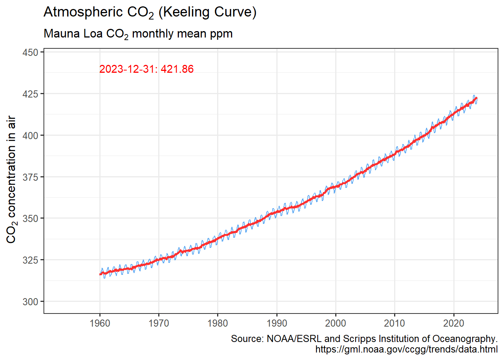

Retrieve GCP global CO<sub>2</sub> emissions and plot:

``` r
emissions <- get_emissions()
plot_emissions(emissions)
```

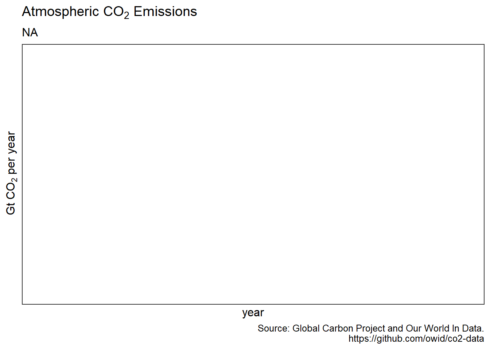

Retrieve NASA/GISS global surface temperature anomaly data and plot:

``` r
anomaly <- get_temp()
plot_temp(anomaly)
```

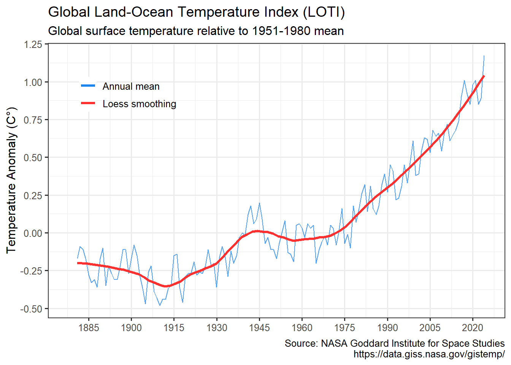

Visualize warming using Ed Hawkins styled “warming stripes”:

``` r
warming_stripes()
```


``` r
warming_stripes(stripe_only = TRUE, col_strip = viridisLite::viridis(11))
```

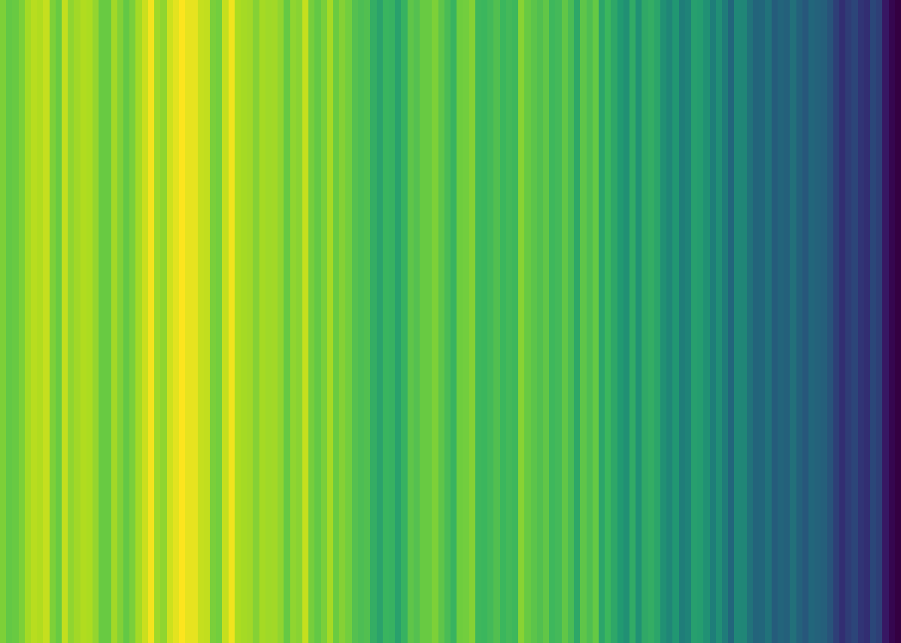

Retrieve tide gauge and satellite sea level data and plot:

``` r
gmsl <- get_sealevel()
plot_sealevel(gmsl)
```

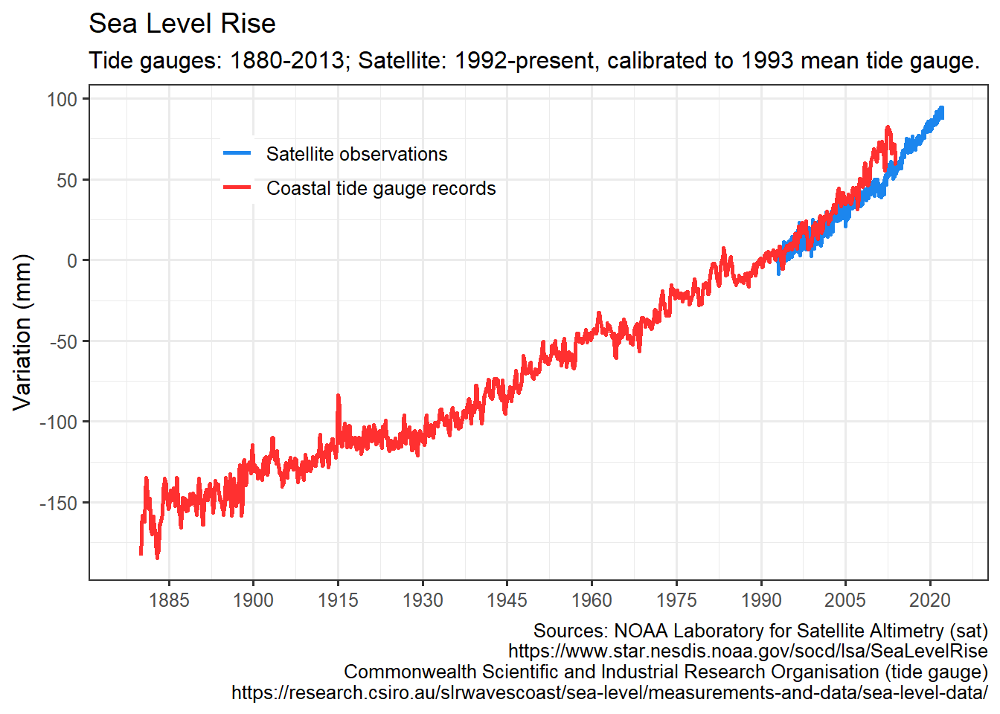

Retrieve July annual Arctic Sea Ice Index and plot:

``` r
seaice <- get_seaice()
plot_seaice(seaice)
```

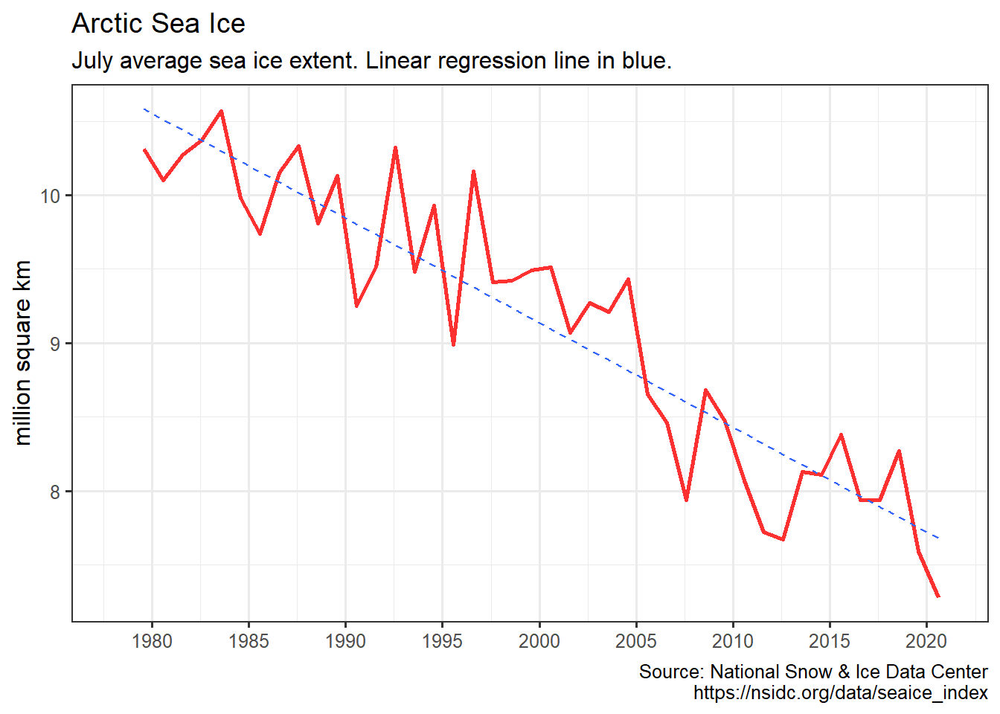

`get_seaice()` arguments can be modified to download Antarctic sea ice,
and allow any month.

You can also visualize sea ice by month and year:

``` r
arcticice <- get_icecurves()
plot_icecurves(arcticice)
```

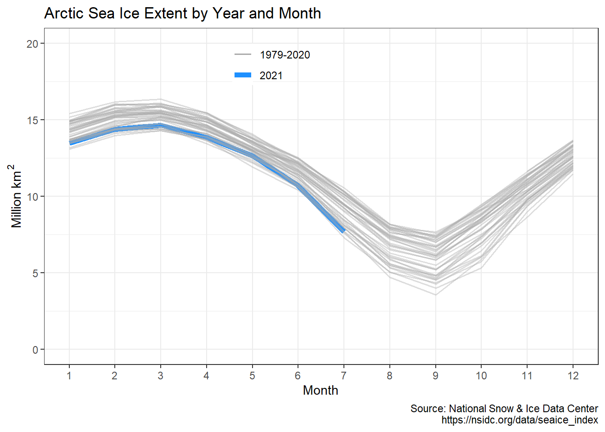

Retrieve Common Era temperature reconstruction and plot it with
instrumental record:

``` r
anomaly2k <- get_temp2k()
plot_temp2k(anomaly2k)
```

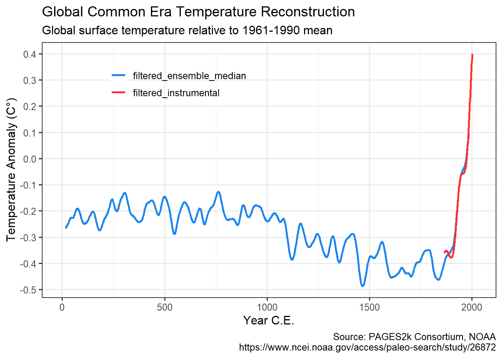

Retrieve NOAA HURDAT2 hurricane data and plot:

``` r
hurricanes <- get_hurricanes()
plot_hurricanes(hurricanes)
```

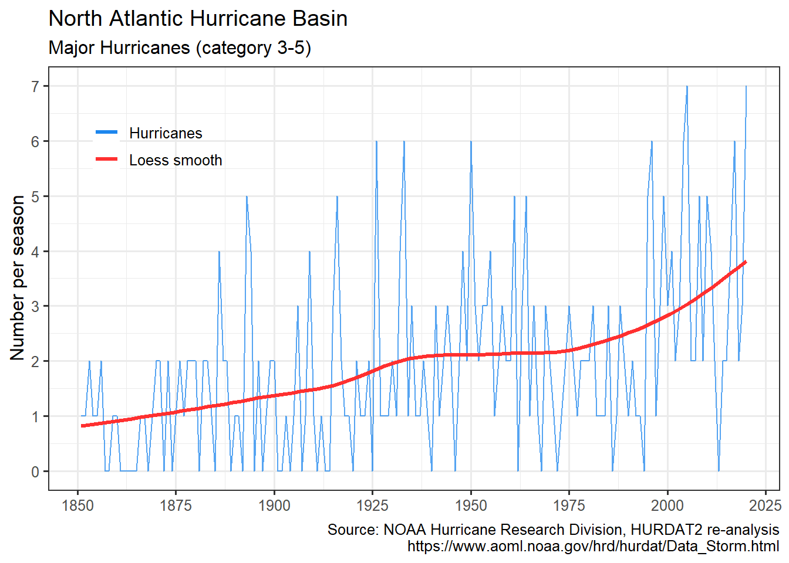

``` r
plot_hurricane_nrg(hurricanes)
```

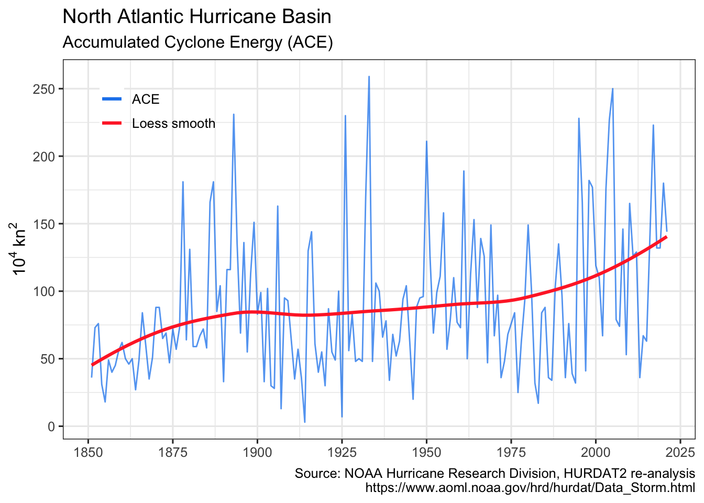

Retrieve Vostok paleo ice core data and plot:

``` r
vostok <- get_paleo()
plot_paleo(vostok)
```

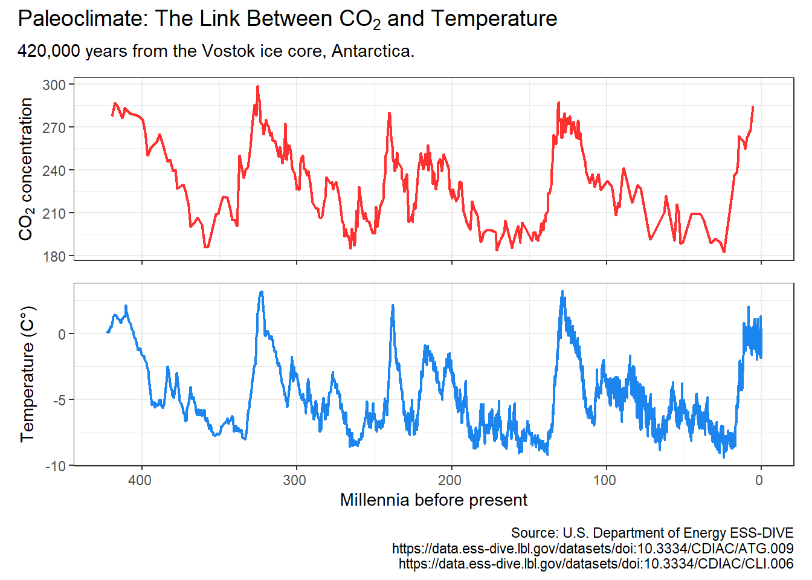

### Managing the cache

By default, no climate data is cached, and all data is downloaded every
time any of the `get_` functions is called. To cache data for future
use, use the `write_cache = TRUE` option, available in all of the `get_`
functions. To download and cache all data use
`hockeystick_update_all()`. To view the files, date, and size of cached
data use `hockeystick_cache_details()`. To re-download data from the
source use the `use_cache = FALSE` argument in any of the `get_`
functions, for example:
`get_carbon(use_cache = FALSE, write_cache = TRUE)`. To delete all
cached data use `hockeystick_cache_delete_all()`.

Users may also cache data by default by adding
`options(hs_write_cache = TRUE)`to their script or `.Rprofile` file.

### All together now: climate data grid

``` r
climate_grid()
```

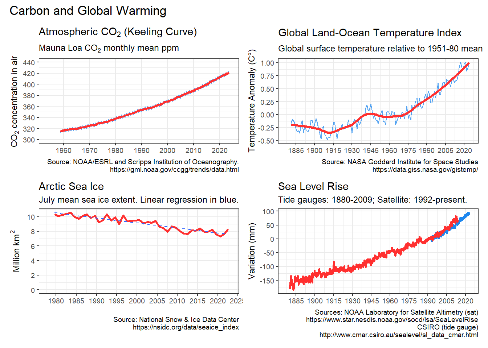

## Acknowledgments

-   Carbon Dioxide concentrations: Dr. Pieter Tans, NOAA/GML
    (<https://gml.noaa.gov/ccgg/trends/>) and Dr. Ralph Keeling,
    [Scripps Institution of Oceanography](https://scrippsco2.ucsd.edu/).
-   Global temperature anomaly: *GISS Surface Temperature Analysis
    (GISTEMP), version 4.* GISTEMP Team, 2020: NASA Goddard Institute
    for Space Studies. <https://data.giss.nasa.gov/gistemp/>
-   Warming Stripes design from Ed Hawkins’ Climate Lab.
    <https://www.climate-lab-book.ac.uk/2018/warming-stripes/>. In
    addition grateful to Dr. Dominic Royé for posting his approach to
    plotting them using ggplot2, which `warming_stripes()` is based on.
    <https://dominicroye.github.io/en/2018/how-to-create-warming-stripes-in-r/>
-   Sea level data: [NOAA Laboratory for Satellite Altimetry
    (sat)](https://www.star.nesdis.noaa.gov/socd/lsa/SeaLevelRise/) and
    [Commonwealth Scientific and Industrial Research Organisation (tide
    gauges)](https://research.csiro.au/slrwavescoast/sea-level/measurements-and-data/sea-level-data/)
-   Sea Ice Index: [National Snow & Ice Data
    Center](https://nsidc.org/). Data Archive:
    <https://nsidc.org/data/seaice_index/archives>
-   Vostok carbon dioxide and temperature data:
    <https://cdiac.ess-dive.lbl.gov/trends/co2/vostok.html>
-   Common Era reconstructed temperature data: [PAGES2k Consortium and
    NOAA](https://www.ncdc.noaa.gov/paleo-search/study/26872).
-   Hurricanes: National Oceanic and Atmospheric Administration HURDAT
    Atlantic Hurricane Database [Re-analysis
    Project](https://www.aoml.noaa.gov/hrd/hurdat/Data_Storm.html),
    particularly Dr. Chris Landsea.
-   Carbon Dioxide emissions: [Global Carbon
    Project](https://www.globalcarbonproject.org/carbonbudget/20/data.htm)
    and [Our World In Data](https://github.com/owid/co2-data)

## Notes and resources

-   All data is compiled to the best of my ability from reliable and
    peer-reviewed sources. Please open an issue if you are aware of
    enhanced or additional data that may be added to the package.
    Building `hockeystick` is driven by my interest in tracking climate
    data and making it easily available to the community.
-   Here are some online resources I have found very helpful to learn
    more about climate science:
-   MIT edX Global Warming Science.
    <https://www.edx.org/course/global-warming-science>
-   SDG Academy: Climate Change: The Science and Global Impact.
    <https://sdgacademy.org/course/climate-change-the-science-and-global-impact/>
