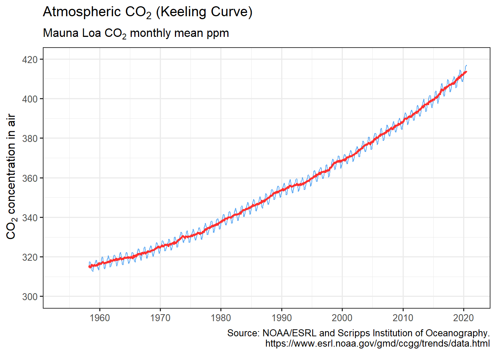

<!-- README.md is generated from README.Rmd. Please edit that file -->

# hockeystick 

<!-- badges: start -->

[](https://www.tidyverse.org/lifecycle/#experimental)
<!-- badges: end -->

The goal of `hockeystick` is to make essential Climate Change datasets
easily available to non-climate experts. `hockeystick` users can
download the latest raw data from authoritative sources as well as view
it via pre-defined ggplot2 charts. Datasets include atmospheric
CO<sub>2</sub>, instrumental and ice-core temperature records, sea
levels, and Arctic sea-ice. Additional visualizations using this data
will be added over time.

## Installation

You can install the development version of `hockeystick` from
<https://github.com/cortinah/hockeystick> with:

``` r
remotes::install_github("cortinah/hockeystick")
```

## Examples

Retrieve NOAA/ESRL Mauna Loa CO<sub>2</sub> Observatory concentration
and plot it:

``` r
library(hockeystick)
ml_co2 <- get_carbon()
plot_carbon(ml_co2)
```



## Acknowledgments

  - Carbon Dioxide dataset: Dr. Pieter Tans, NOAA/GML
    (www.esrl.noaa.gov/gmd/ccgg/trends/) and Dr. Ralph Keeling, Scripps
    Institution of Oceanography (www.scrippsco2.ucsd.edu/).
  - Caching data sets: ROpenSci guide to [Persistent config and data for
    R packages](https://blog.r-hub.io/2020/03/12/user-preferences/) and
    the [getlandsat](https://docs.ropensci.org/getlandsat/) package.

## Notes and Resources

  - While all data is compiled from reliable sources, I am not a climate
    scientist. I am building `hockeystick` because of my interest in
    tracking climate data and making it available to the community.
  - Here are some online resources I have found very helpful to learn
    more about climate science:
  - MIT edX Global Warming Science.
    <https://www.edx.org/course/global-warming-science>
  - SDG Academy: Climate Change: The Science and Global Impact.
    <https://sdgacademy.org/course/climate-change-the-science-and-global-impact/>
