<!-- README.md is generated from README.Rmd. Please edit that file -->

# hockeystick 

<!-- badges: start -->

[](https://lifecycle.r-lib.org/articles/stages.html#stable)

[](https://CRAN.R-project.org/package=hockeystick)
[](https://cran.r-project.org/package=hockeystick)

<!-- badges: end -->

The goal of `hockeystick` is to make essential Global Heating datasets
easily available in R to non-climate experts. `hockeystick` users can
download the latest raw data from authoritative sources as well as view
it via pre-defined ggplot2 charts. Datasets include atmospheric
CO<sub>2</sub> and CH<sub>4</sub>, carbon emissions, instrumental,
reconstructed, and paleo ice-core temperature records, sea levels,
hurricanes, and Arctic/Antarctic sea-ice.

The choice of data was originally based on [Professor Stefan
Rahmstorf’s](http://www.pik-potsdam.de/~stefan/) presentation on [The 5
Most Important Data Sets of Climate
Science](http://www.pik-potsdam.de/~stefan/5datasets_rahmstorf.pdf). I
came across this on a post on the [Open Mind
blog](https://tamino.wordpress.com/2018/11/01/the-5-most-important-data-sets-of-climate-science/).
I wrote my own
[post](https://rethinking.rbind.io/2018/11/16/the-top-five-climate-charts-using-ggplot2/)
on obtaining and visualizing this data (now out of date), which is the
basis for this package. Additional datasets and visualizations have been
added over The name of the package stems from the well known
[hockeystick](https://en.wikipedia.org/wiki/Hockey_stick_graph)
temperature chart.

`hockeystick` was highlighted on the RStudio
[RViews](https://rviews.rstudio.com/2021/03/19/february-2021-top-40-new-cran-packages/)
blog by Joseph Rickert as one of the “Top 40” new packages on CRAN in
February 2021.

**New in version 0.8.0:** Daily temperature data from
ClimateReanalyzer.com (see below).

New in version 0.7.0: Globally averaged methane (CH<sub>4</sub>)
concentration from NOAA.

New in version 0.7.0: Cumulative emissions by country visualization.

New in version 0.6.0: Global CO<sub>2</sub> emissions by region and
country from GCP.

## Installation

To install the latest `hockeystick` release from CRAN type:

``` r
install.packages("hockeystick")
```

You may alternatively install the development version from
<https://github.com/cortinah/hockeystick> with:

``` r
remotes::install_github("cortinah/hockeystick@testing")
```

## Downloading and viewing global heating data

Plot daily global temperatures since 1940 and current anomaly:

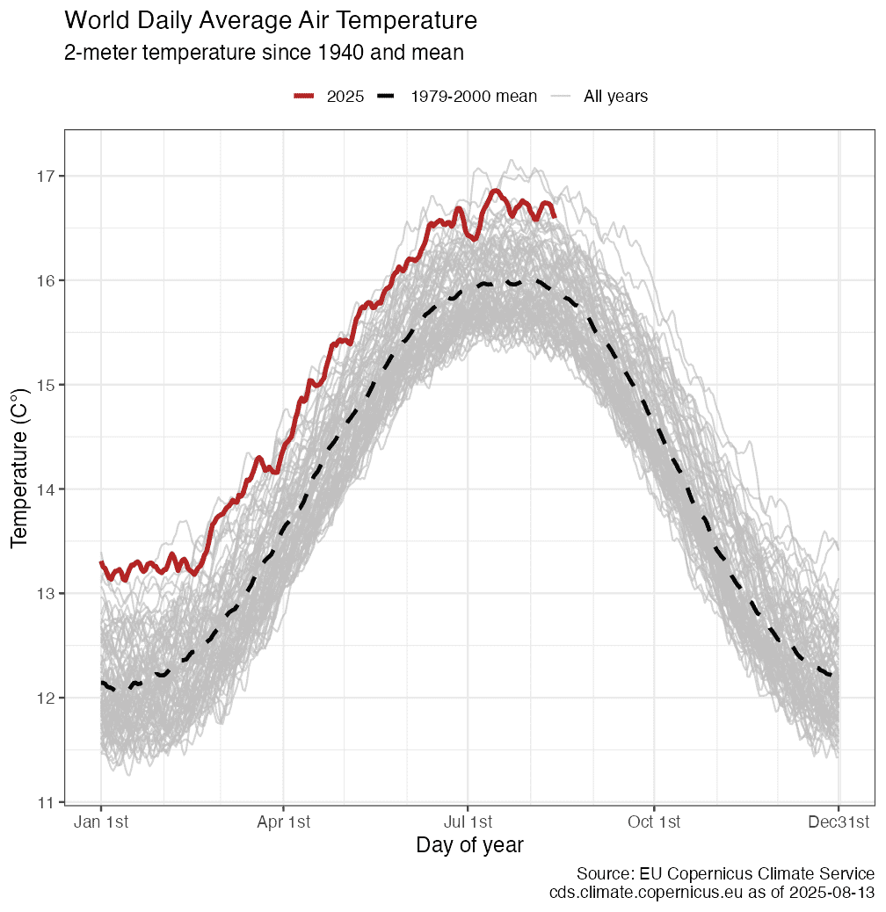

Retrieve NOAA/ESRL Mauna Loa CO<sub>2</sub> Observatory concentration
data and plot:

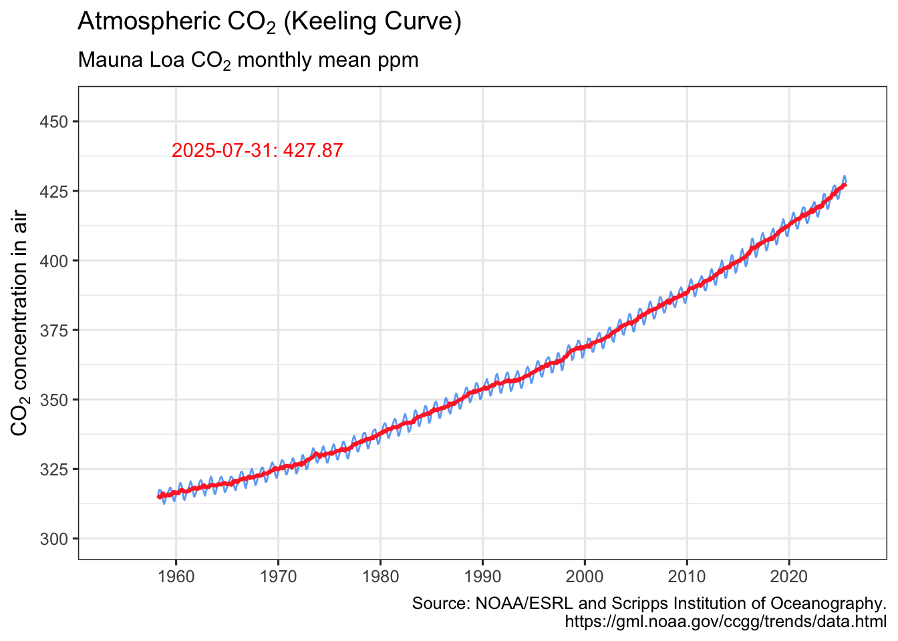

Retrieve GCP global CO<sub>2</sub> emissions and plot:

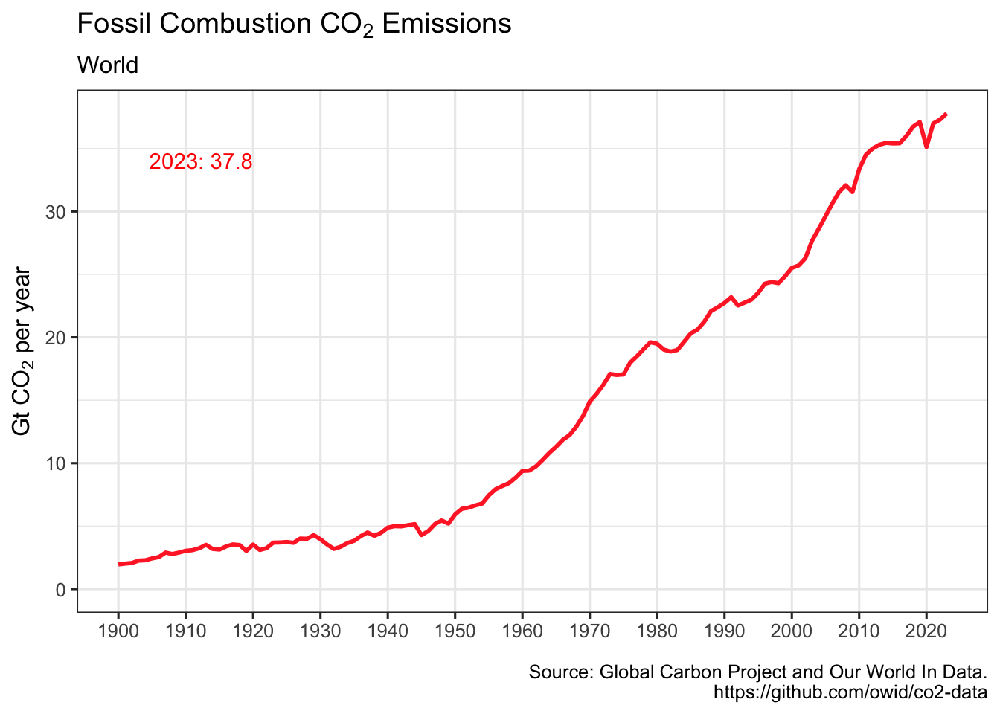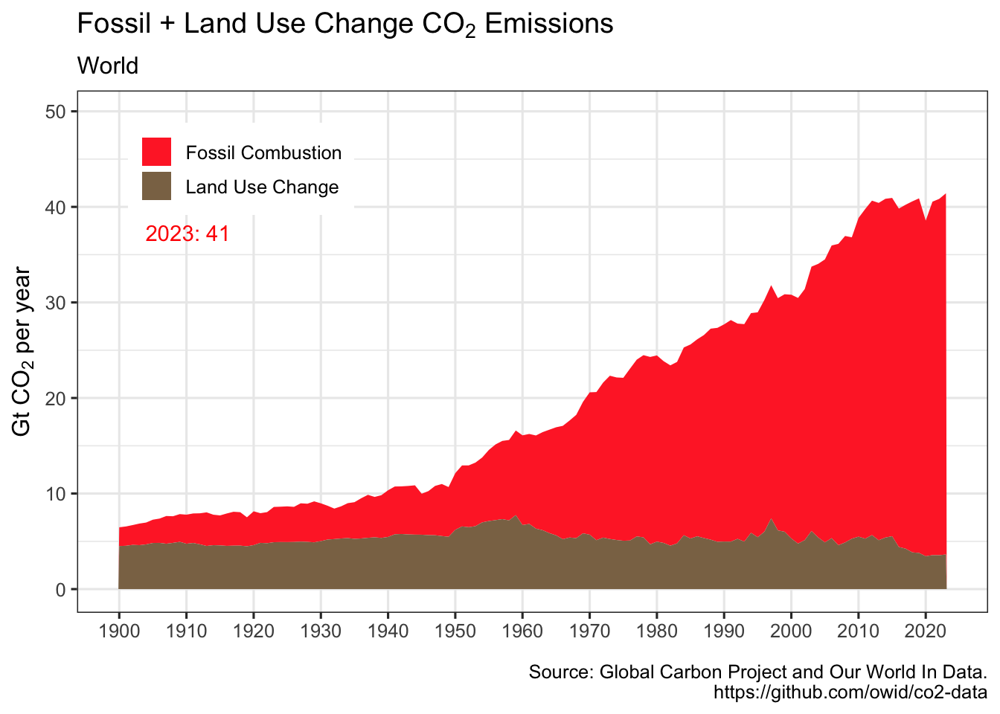

Visualize cumulative emissions by country:
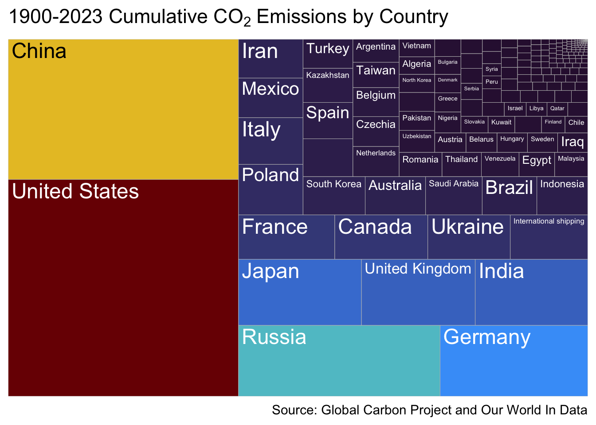

Retrieve NASA/GISS global surface temperature anomaly data and plot:

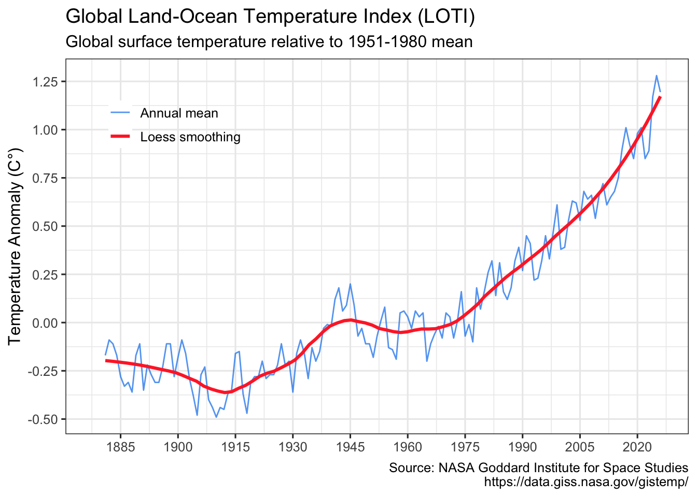

Plot relationship between temperature anomaly and carbon:
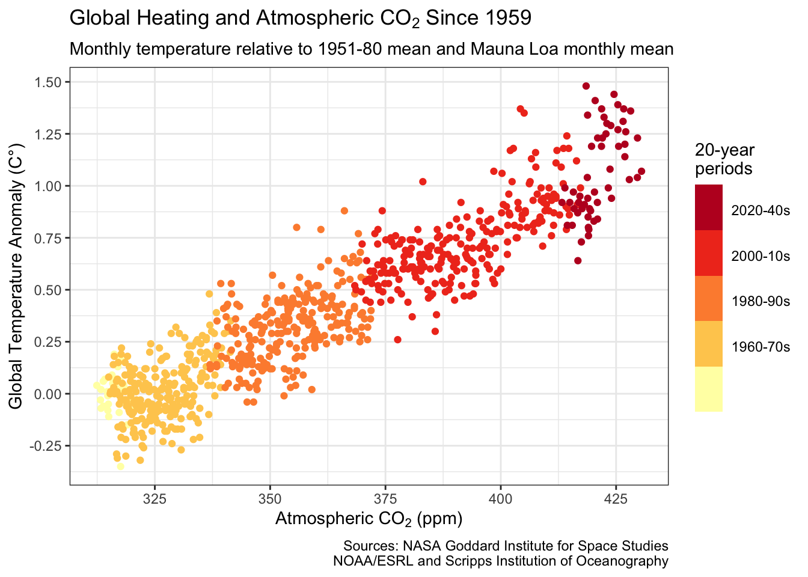

Visualize warming using Ed Hawkins styled “warming stripes”:
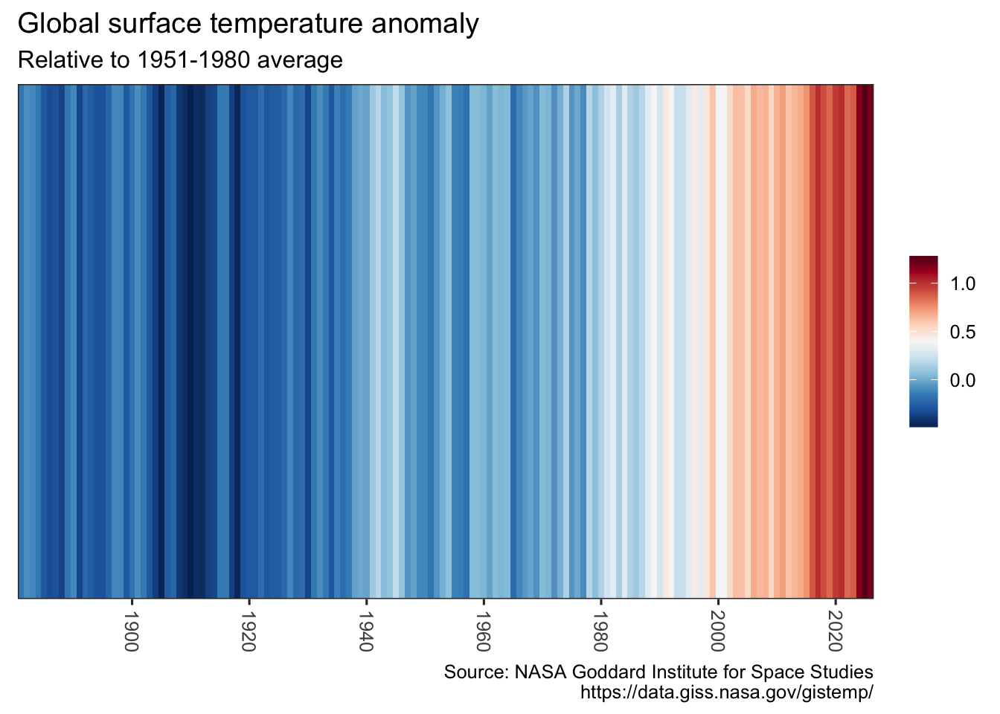


Retrieve tide gauge and satellite sea level data and plot:

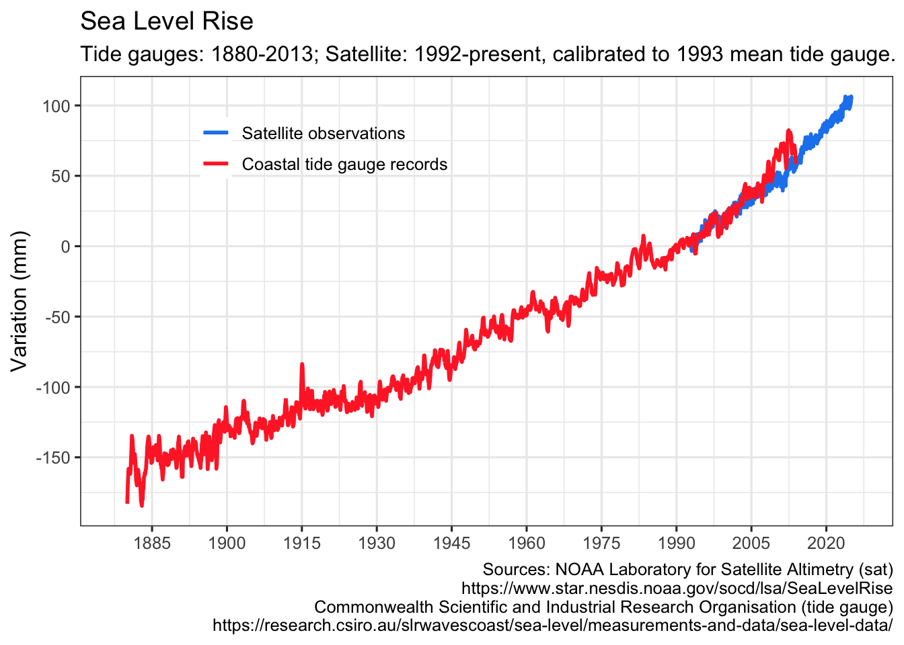

Retrieve July annual Arctic Sea Ice Index and plot:


`get_seaice()` arguments can be modified to download Antarctic sea ice,
and allow any month.

You can also visualize sea ice by month and year:

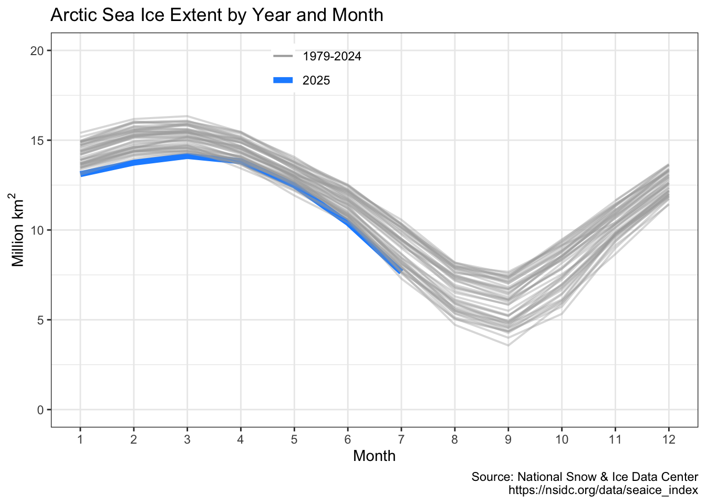

Retrieve Common Era temperature reconstruction and plot it with
instrumental record:


Retrieve NOAA HURDAT2 hurricane data and plot:

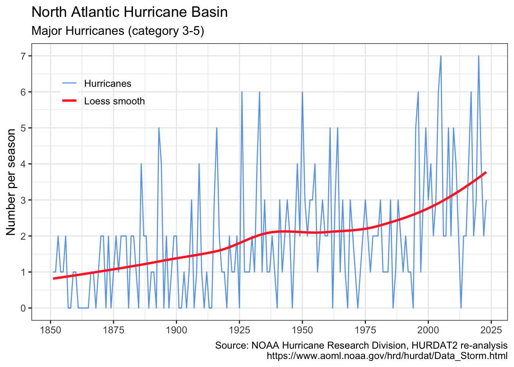

Retrieve NOAA/ESRL CH<sub>4</sub> Globally averaged mean data and plot:

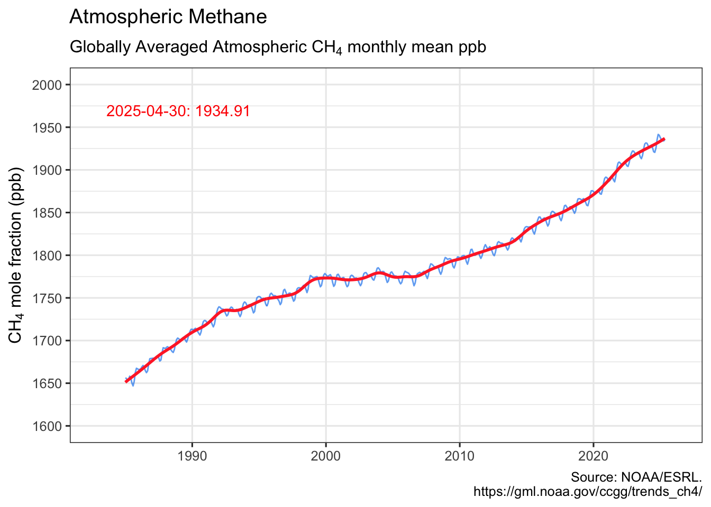

Retrieve Vostok paleo ice core data and plot:


### Managing the cache

By default, no climate data is cached, and all data is downloaded every
time any of the `get_` functions is called. To cache data for future
use, use the `write_cache = TRUE` option, available in all of the `get_`
functions. To download and cache all data use
`hockeystick_update_all()`. To view the files, date, and size of cached
data use `hockeystick_cache_details()`. To re-download data from the
source use the `use_cache = FALSE` argument in any of the `get_`
functions, for example:
`get_carbon(use_cache = FALSE, write_cache = TRUE)`. To delete all
cached data use `hockeystick_cache_delete_all()`.

Users may also cache data by default by adding
`options(hs_write_cache = TRUE)`to their script or `.Rprofile` file.

### All together now: climate data grid


## Acknowledgments

- Carbon Dioxide concentrations: Dr. Pieter Tans, NOAA/GML
  (<https://gml.noaa.gov/ccgg/trends/>) and Dr. Ralph Keeling, [Scripps
  Institution of Oceanography](https://scrippsco2.ucsd.edu/).
- Global temperature anomaly: *GISS Surface Temperature Analysis
  (GISTEMP), version 4.* GISTEMP Team, 2020: NASA Goddard Institute for
  Space Studies. <https://data.giss.nasa.gov/gistemp/>
- Warming Stripes design from Ed Hawkins’ Climate Lab.
  <https://www.climate-lab-book.ac.uk/2018/warming-stripes/>. In
  addition grateful to Dr. Dominic Royé for posting his approach to
  plotting them using ggplot2, which `warming_stripes()` is based on.
  <https://dominicroye.github.io/en/2018/how-to-create-warming-stripes-in-r/>
- Sea level data: [NOAA Laboratory for Satellite Altimetry
  (sat)](https://www.star.nesdis.noaa.gov/socd/lsa/SeaLevelRise/) and
  [Commonwealth Scientific and Industrial Research Organisation (tide
  gauges)](https://research.csiro.au/slrwavescoast/sea-level/measurements-and-data/sea-level-data/)
- Sea Ice Index: [National Snow & Ice Data
  Center](https://nsidc.org/home). Data Archive:
  <https://nsidc.org/data/explore-data>
- Vostok carbon dioxide and temperature data:
  <https://data.ess-dive.lbl.gov/datasets/doi:10.3334/CDIAC/ATG.009>
- Common Era reconstructed temperature data: [PAGES2k Consortium and
  NOAA](https://www.ncei.noaa.gov/access/paleo-search/study/26872)).
- Hurricanes: National Oceanic and Atmospheric Administration HURDAT
  Atlantic Hurricane Database [Re-analysis
  Project](https://www.aoml.noaa.gov/hrd/hurdat/Data_Storm.html),
  particularly Dr. Chris Landsea.
- Carbon Dioxide emissions: [Global Carbon
  Project](https://www.globalcarbonproject.org/carbonbudget/) and [Our
  World In Data](https://github.com/owid/co2-data)
- Methane: Lan, X., K.W. Thoning, and E.J. Dlugokencky, NOAA Global
  Monitoring Laboratory (<https://gml.noaa.gov/ccgg/trends_ch4/>).
- Thank you to Dirk Eddelbuettel for providing the .isConnected function
  from his [tint](https://CRAN.R-project.org/package=tint) package to
  test for internet connectivity.
- Thank you to Chris Campbell and Steven Bernard of the FT Climate
  Graphics Explained newsletter for sharing their code for
  climatereanalyzer.org daily temperature chart (Temperature Records
  Broken…Again, 9 July 2023). This code is the foundation of the
  get_dailytemp() and plot_dailytemp() functions.
- Thank you Nan Xiao for [PNG compression
  approach](https://nanx.me/blog/post/rpkgs-pngquant-ragg/).

## Notes and resources

- All data is compiled to the best of my ability from reliable and
  peer-reviewed sources. Please open an issue if you are aware of
  enhanced or additional data that may be added to the package. Building
  `hockeystick` is driven by my interest in tracking climate data and
  making it easily available to the community.
- Here are some online resources I have found very helpful to learn mo
  re about climate science:
- MIT edX Global Warming Science.
  <https://www.edx.org/learn/global-warming/massachusetts-institute-of-technology-global-warming-science>
- SDG Academy: Climate Change: The Science and Global Impact.
  <https://sdgacademy.org/course/climate-change-the-science-and-global-impact/>
