# Using Hockeystick

`hockeystick` includes functions to download and visualized climate
data. Data is optionally cached.

### Retrieve NOAA/ESRL Mauna Loa CO₂ Observatory concentration data and plot:

``` r

library(hockeystick)
ml_co2 <- get_carbon()
plot_carbon(ml_co2)
```

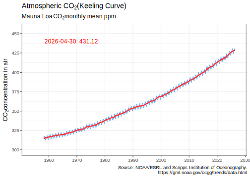

### Retrieve GCP global CO₂ emissions and plot:

``` r

emissions <- get_emissions()
plot_emissions(emissions)
```

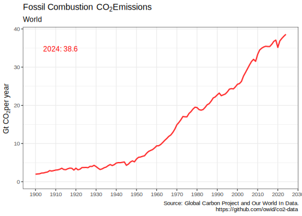

``` r

plot_emissions_with_land(emissions)
```

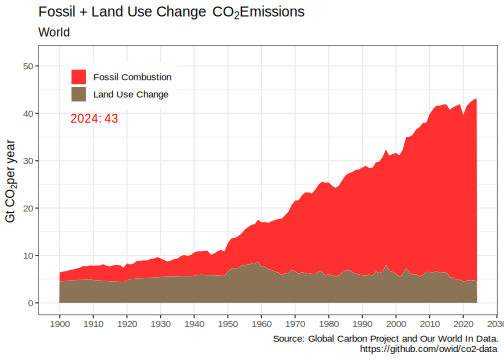

### Visualize cumulative emissions by country:

``` r

emissions_map()
```

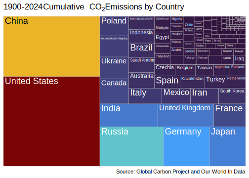

### Retrieve NASA/GISS global surface temperature anomaly data and plot:

``` r

anomaly <- get_temp()
plot_temp(anomaly)
```

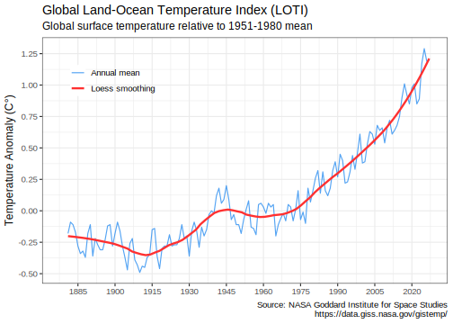

### Plot relationship between temperature anomaly and carbon:

``` r

plot_carbontemp()
```

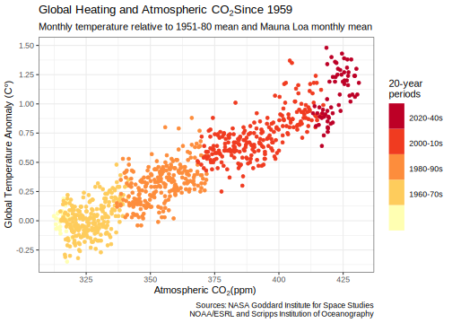

### Visualize warming using Ed Hawkins styled “warming stripes”:

``` r

warming_stripes()
```

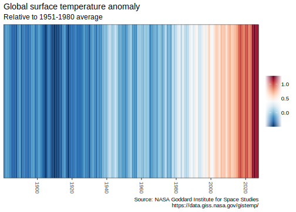

``` r

warming_stripes(stripe_only = TRUE, col_strip = viridisLite::viridis(11))
```


### Retrieve tide gauge and satellite sea level data and plot:

``` r

gmsl <- get_sealevel()
plot_sealevel(gmsl)
```

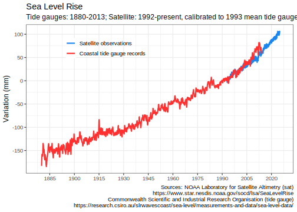

### Retrieve July annual Arctic Sea Ice Index and plot:

``` r

seaice <- get_seaice()
plot_seaice(seaice)
```

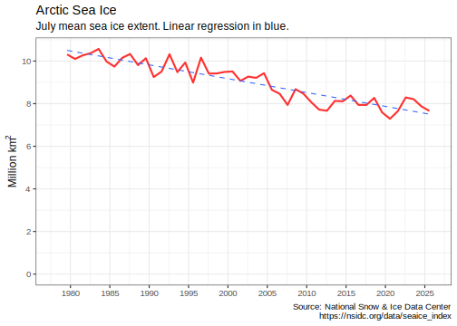

[`get_seaice()`](../reference/get_seaice.md) arguments can be modified
to download Antarctic sea ice, and allow any month.

You can also visualize sea ice by month and year:

``` r

arcticice <- get_icecurves()
plot_icecurves(arcticice)
```

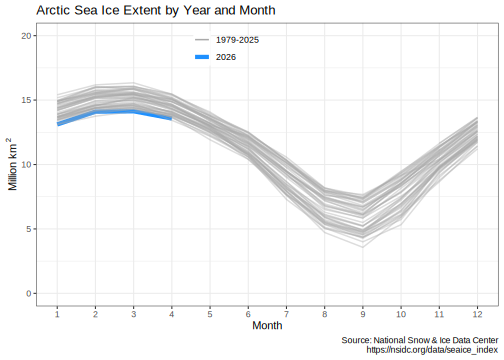

### Retrieve NOAA HURDAT2 hurricane data and plot:

``` r

hurricanes <- get_hurricanes()
plot_hurricanes(hurricanes)
```

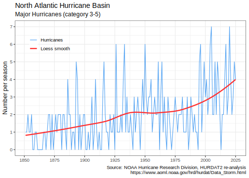

``` r

plot_hurricane_nrg(hurricanes)
```

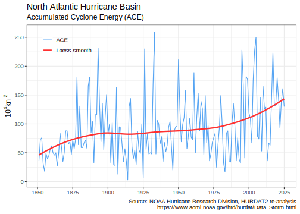

### Retrieve GWIS wildfire data and plot:

``` r

usfires <- get_fires_area(place='USA', year = 2026)
plot_fires_area(usfires)
```

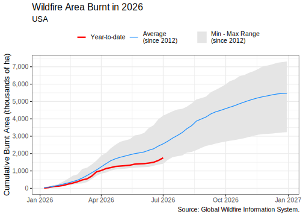

``` r

plot_fires_area(usfires, style = 'weekly')
```

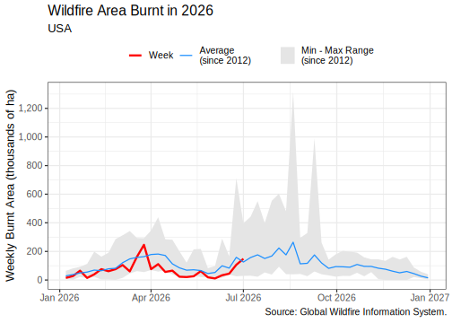

### Retrieve NOAA/ESRL CH₄ Globally averaged mean data and plot:

``` r

ch4 <- get_methane()
plot_methane(ch4)
```

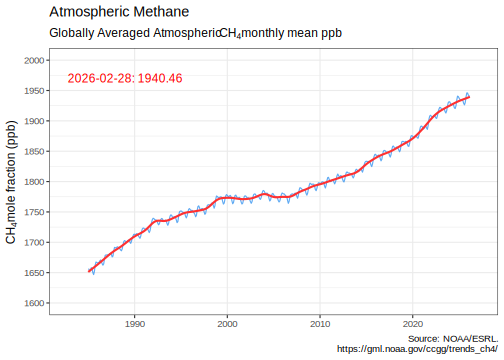

### Retrieve Vostok paleo ice core data and plot:

``` r

vostok <- get_paleo()
plot_paleo(vostok)
```

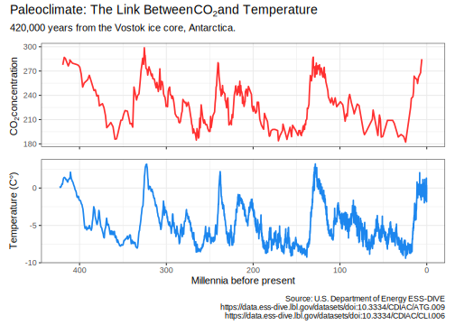

### Managing the cache

By default, no climate data is cached, and all data is downloaded every
time any of the `get_` functions is called. To cache data for future
use, use the `write_cache = TRUE` option, available in all of the `get_`
functions. To download and cache all data use
[`hockeystick_update_all()`](../reference/hockeystick_cache.md). To view
the files, date, and size of cached data use
[`hockeystick_cache_details()`](../reference/hockeystick_cache.md). To
re-download data from the source use the `use_cache = FALSE` argument in
any of the `get_` functions, for example:
`get_carbon(use_cache = FALSE, write_cache = TRUE)`. To delete all
cached data use
[`hockeystick_cache_delete_all()`](../reference/hockeystick_cache.md).

Users may also cache data by default by adding
`options(hs_write_cache = TRUE)`to their script or `.Rprofile` file.
